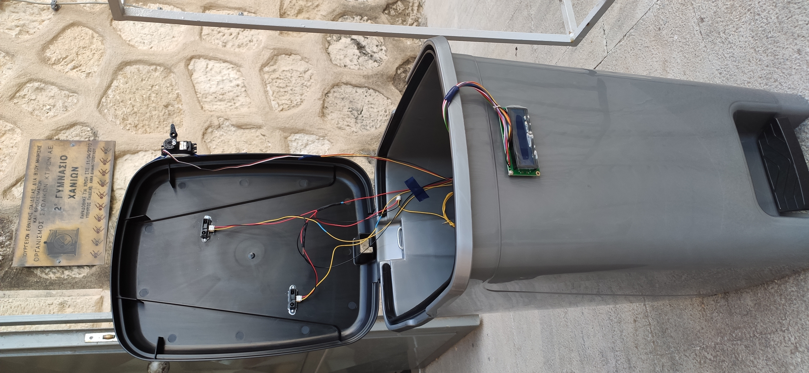

# 2ο Γυμνάσιο Χανίων - 4oς Πανελλήνιος Διαγωνισμός Ανοιχτών Τεχνολογιών

Η ομάδα Transformers του 2ου Γυμνάσιου Χανίων συμμετέχει στον 4o Πανελλήνιο Διαγωνισμό Ανοιχτών Τεχνολογιών, σχεδιάζοντας, προγραμματίζοντας και κατασκευάζοντας το πρωτότυπο ρομπότ binBot. Το binBot είναι ένα ρομπότ που εφαρμόζει την κυκλική οικονομία στη διαχείριση των απορριμάτων.

Η ιστοσελίδα της ομάδας στο robotics.ellak βρίσκεται στην παρακάτω διεύθυνση:
λξηηκηκηκηκηη

*Η ομάδα Transformers και το πρωτότυπο ρομπότ κυκλικής οικονομίας binBot*

## Έρευνα και σχεδίαση
### Μελέτη υπάρχουσας κατάστασης
Η πρόταση του 2ου Γυμνάσιου Χανίων για τον 4ο Πανελλήνιο Διαγωνισμό Ανοιχτών Τεχνολογιών στην Εκπαίδευση, είναι το **BinBot**. Πρόκειται για έναν *έξυπνο* κάδο απορριμμάτων, ο οποίος μόλις το περιεχόμενό του φτάνει σε ένα συγκεκριμένο επίπεδο θα κλειδώνει, με αποτέλεσμα να μη δέχεται άλλα σκουπίδια. Η ιδέα του *έξυπνου* κάδου BinBot, αποτελεί προϊόν έρευνας κατά τη διάρκεια του μαθήματος της Τεχνολογίας, της τάξης Β’ Γυμνασίου, της ακαδημαϊκής χρονιάς 2021-22. Το θέμα της έρευνας  ήταν η *έξυπνη* πόλη: πως δηλαδή οι τεχνολογίες πληροφοριών και επικοινωνιών συμβάλουν στην **κυκλική οικονομία** της λειτουργίας των πόλεων. Ενισχύοντας την αποτελεσματικότητας τους, βελτιώνοντας την ανταγωνιστικότητάς τους, και παρέχοντας νέους τρόπους με τους οποίους μπορούν να αντιμετωπιστούν τα προβλήματα της φτώχειας, της ανεργίας, του κοινωνικού αποκλεισμού και του υποβαθμισμένου περιβάλλοντος.

Ο έξυπνος κάδος απορριμμάτων BinBot, κατασκευάστηκε από ανακυκλώσιμα υλικά και έχει αισθητήρες για τον προσδιορισμό της κατάστασης πληρότητάς του. Έξω από τον κάδο θα υπάρχει ένας φωτεινός σηματοδότης (οθόνη υγρών κρυστάλλων), ο οποίος θα έχει πράσινο χρώμα όταν ο κάδος είναι άδειος, πορτοκαλί χρώμα όταν ο κάδος είναι μισογεμάτος και κόκκινο χρώμα όταν ο κάδος είναι γεμάτος. Έτσι, οι πολίτες θα γνωρίζουν αν ένας κάδος είναι γεμάτος και δε θα πρέπει να πετάξουν τα σκουπίδια τους σε αυτόν. Η ενημέρωση σχετικά με την κατάσταση των αστικών κάδων απορριμμάτων θα γίνεται μέσα από ένα σύστημα οθόνης, το οποίο θα παρακολουθούν οι πολίτες και οι οδηγοί των απορριμματοφόρων μέσα σε αυτά. Έτσι θα γνωρίζουν που πρέπει να πάνε και ποιους κάδους θα αδειάσουν. Με αυτό τον τρόπο μειώνονται τα άσκοπα δρομολόγια και κατ' επέκταση η ρύπανση.

## Λίστα προτεινόμενου εξοπλισμού
1. [Γραμμικός ενεργοποιητής](https://grobotronics.com/solenoid-12v-jf-0826b.html) για τον έλεγχο κλειδώματος του δοχείου, δύο τεμάχια συνολικού κόστους 16€,
2. [ηλεκτρονόμος](https://grobotronics.com/relay-module-4-channel.html) για τον έλεγχο του γραμμικού ενεργοποιητή (6€),
3. [αισθητήρας υπολογισμού θέσης](https://grobotronics.com/infrared-proximity-sensor-short-range-sharp-gp2y0a41sk0f.html) για τον έλεγχο πληρότητας του δοχείου, δύο τεμάχια συνολικού κόστους 24€,
4. [ρομποτικός ελεγκτής Arduino Uno Rev3](https://grobotronics.com/arduino-uno-rev3.html) (22€),
5. δοχεία απορριμάτων και σχετικές κατασκευές στήριξής τους (40€) και
6. καλώδια διάφορων ειδών και πλακέτες δοκιμών (20€).
## Ενδεικτικό κόστος
Εντός των παρενθέσεων στη λίστα προτεινόμενου εξοπλισμού αναφέρεται το ενδεικτικό κόστος για το κάθε εξάρτημα του ρομπότ. Το συνολικό κόστος περιορίστηκε στα **125€**.

