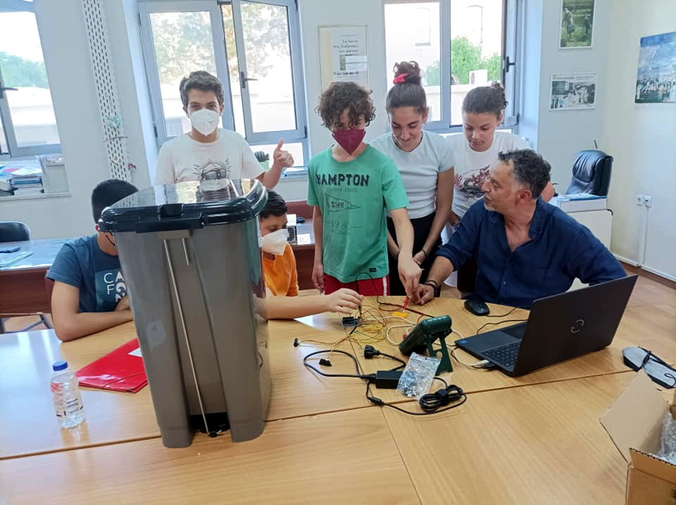

# 2ο Γυμνάσιο Χανίων - 4oς Πανελλήνιος Διαγωνισμός Ανοιχτών Τεχνολογιών

Η ομάδα Transformers του 2ου Γυμνάσιου Χανίων συμμετέχει στον 4o Πανελλήνιο Διαγωνισμό Ανοιχτών Τεχνολογιών, σχεδιάζοντας, προγραμματίζοντας και κατασκευάζοντας το πρωτότυπο ρομπότ binBot. Το binBot είναι ένα ρομπότ που εφαρμόζει την κυκλική οικονομία στη διαχείριση των απορριμάτων.

Η ιστοσελίδα της ομάδας στο robotics.ellak βρίσκεται στην παρακάτω διεύθυνση:
λξηηκηκηκηκηη

*Η ομάδα Transformers και το πρωτότυπο ρομπότ κυκλικής οικονομίας binBot*

## Έρευνα και σχεδίαση
### Μελέτη υπάρχουσας κατάστασης
Η πρόταση του 2ου Γυμνάσιου Χανίων για τον 4ο Πανελλήνιο Διαγωνισμό Ανοιχτών Τεχνολογιών στην Εκπαίδευση, είναι το **BinBot**. Πρόκειται για έναν *έξυπνο* κάδο απορριμμάτων, ο οποίος μόλις το περιεχόμενό του φτάνει σε ένα συγκεκριμένο επίπεδο θα κλειδώνει, με αποτέλεσμα να μη δέχεται άλλα σκουπίδια. Η ιδέα του *έξυπνου* κάδου BinBot, αποτελεί προϊόν έρευνας κατά τη διάρκεια του μαθήματος της Τεχνολογίας, της τάξης Β’ Γυμνασίου, της ακαδημαϊκής χρονιάς 2021-22. Το θέμα της έρευνας  ήταν η *έξυπνη* πόλη: πως δηλαδή οι τεχνολογίες πληροφοριών και επικοινωνιών συμβάλουν στην **κυκλική οικονομία** της λειτουργίας των πόλεων. Ενισχύοντας την αποτελεσματικότητας τους, βελτιώνοντας την ανταγωνιστικότητάς τους, και παρέχοντας νέους τρόπους με τους οποίους μπορούν να αντιμετωπιστούν τα προβλήματα της φτώχειας, της ανεργίας, του κοινωνικού αποκλεισμού και του υποβαθμισμένου περιβάλλοντος.

Ο έξυπνος κάδος απορριμμάτων BinBot, κατασκευάστηκε από ανακυκλώσιμα υλικά και έχει αισθητήρες για τον προσδιορισμό της κατάστασης πληρότητάς του. Έξω από τον κάδο θα υπάρχει ένας φωτεινός σηματοδότης (οθόνη υγρών κρυστάλλων), ο οποίος θα έχει πράσινο χρώμα όταν ο κάδος είναι άδειος, πορτοκαλί χρώμα όταν ο κάδος είναι μισογεμάτος και κόκκινο χρώμα όταν ο κάδος είναι γεμάτος. Έτσι, οι πολίτες θα γνωρίζουν αν ένας κάδος είναι γεμάτος και δε θα πρέπει να πετάξουν τα σκουπίδια τους σε αυτόν. Η ενημέρωση σχετικά με την κατάσταση των αστικών κάδων απορριμμάτων θα γίνεται μέσα από ένα σύστημα οθόνης, το οποίο θα παρακολουθούν οι πολίτες και οι οδηγοί των απορριμματοφόρων μέσα σε αυτά. Έτσι θα γνωρίζουν που πρέπει να πάνε και ποιους κάδους θα αδειάσουν. Με αυτό τον τρόπο μειώνονται τα άσκοπα δρομολόγια και κατ' επέκταση η ρύπανση.

*To ρομπότ κυκλικής οικονομίας binBot, στην είσοδο του 2ου Γυμνάσιου Χανίων*

# Ορισμός του προβλήματος
Με τη βοήθεια του ρομπότ binBot μπορούν να αντιμετωπιστούν τα παρακαω προβλήματα:
- Αποτελεσματική διαχείρηση απορριμάτων από τα απορριματοφόρα οχήματα
- Καθαρότερες πόλεις
- Εξοικονόμιση ενέργειας

Αναλυτική περιγραφή της ιδέας

Η ιδέα για την κατασκευή ενός *Σκουπιδορομπότ* οδήγησε τους μαθητές στη σχεδίαση του binBot. Το ρομπότ αυτό βασίζεται στη σωστή διαχείριση των απορριμμάτων με ένα μοντέλο έξυπνου κάδου. Ο κάδος θα είναι φτιαγμένος από ανακυκλώσιμα υλικά και θα υπάρχουν δυο μοντέλα ένα για τα ανακυκλώσιμα σκουπίδια και ένα άλλο για τα μη ανακυκλώσιμα. Ο κάδος θα έχει δυο λειτουργίες μια να σφραγίζει όταν γεμίζει και να ειδοποιεί το τμήμα καθαριότητας του δήμου για την γρηγορότερη δυνατή αποκομιδή. Σε αυτό θα βοηθούν οι αισθητήρες που θα είναι τοποθετημένοι στο εσωτερικό του κάδου. Στην εφαρμογή θα εμφανίζεται η τοποθεσία των κάδων και η πληρότητα τους με τρία χρώματα πράσινο σχεδόν άδειος, πορτοκαλί μισό γεμάτος και κόκκινο που θα σημαίνει ότι αυτός ο κάδος έχει σφραγίσει το καπάκι του.

Κάποια αρχικά σχέδια για το πως φαντάζεται η ομάδα το ρομπότ binBot είναι διαθέσιμα στο αποθετήριο της ομάδας, στη διεύθυνση:
- 

Το ρομπότ αποτελείται από τα παρακάτω βασικά τμήματα:
1. Δοχείο απορριμάτων
2. Ρομποτικός ελεγκτής Arduino Uno
3. Δύο αισθητήρες υπερύθρων, υπολογισμού απόστασης
4. Ενεργοποιητή σέρβο
5. Οθόνη υγρών κρυστάλλων
6. Καλώδια, υλικά κατασκευής και συναρμολόγησης

*Οι δύο αισθητήρες υπερύθρων τοποθετημένοι στην εσωτερική μεριά του καπακιού του κάδου*

Η σχεδίαση του ρομπότ επέλεξε υλικό και λογισμικό ανοιχτής αρχιτεκτόνικής. Οι αισθητήρες υπερύθρων είναι δύο, τοποθετημένοι στο καπάκι του δοχείου, με προσανατολισμό προς το εσωτερικό του δοχείου. Μπορούν ανα πάσα στιγμή να καθορίζουν την πληρότητα του δοχείου, μετρώντας την απόσταση από την κορυφή των απορριμάτων εντός του δοχείου.

*Ο ενεργοποιητής τύπου RC servo, για το κλείδωμα του καπακιού του δοχείου*

Ο ενεργοποιητής επιλέχθηκε να είναι της μορφής RC servo για τη δυνατότητά του να περιστρέφεται στα δύο ακραία σημεία που αντιστοιχούν στο ανοιχτό ή κλειστό καπάκι.

*Η οθόνη υγρών κρυστάλλων χρησιμοποιείται για την προβολή μηνυμάτων. Διακρίνεται και ο ρομποτικός ελεγκτής Arduino.*

Η οθόνη υγρών κρυστάλλων ενημερώνει το χρήστη του δοχείου αλλά και το προσωπικό συλλογής απορριμάτων για την κατάσταση πληρότητας του κάδου.

## Λίστα προτεινόμενου εξοπλισμού
1. [Γραμμικός ενεργοποιητής](https://grobotronics.com/solenoid-12v-jf-0826b.html) για τον έλεγχο κλειδώματος του δοχείου, δύο τεμάχια συνολικού κόστους 16€,
2. [ηλεκτρονόμος](https://grobotronics.com/relay-module-4-channel.html) για τον έλεγχο του γραμμικού ενεργοποιητή (6€),
3. [αισθητήρας υπολογισμού θέσης](https://grobotronics.com/infrared-proximity-sensor-short-range-sharp-gp2y0a41sk0f.html) για τον έλεγχο πληρότητας του δοχείου, δύο τεμάχια συνολικού κόστους 24€,
4. [ρομποτικός ελεγκτής Arduino Uno Rev3](https://grobotronics.com/arduino-uno-rev3.html) (22€),
5. δοχείο απορριμάτων και σχετικές κατασκευές στήριξής τους (40€) και
6. καλώδια διάφορων ειδών και πλακέτες δοκιμών (20€).
## Ενδεικτικό κόστος
Εντός των παρενθέσεων στη λίστα προτεινόμενου εξοπλισμού αναφέρεται το ενδεικτικό κόστος για το κάθε εξάρτημα του ρομπότ. Το συνολικό κόστος περιορίστηκε στα **125€**.

*Σχέδια της αρχικής ιδέας για το πρωτότυπο ρομπότ κυκλικής οικονομίας binBot*

*Εναλλακτικά σχέδια της αρχικής ιδέας για το πρωτότυπο ρομπότ κυκλικής οικονομίας binBot*

*Εναλλακτικά σχέδια της αρχικής ιδέας για το πρωτότυπο ρομπότ κυκλικής οικονομίας binBot*
